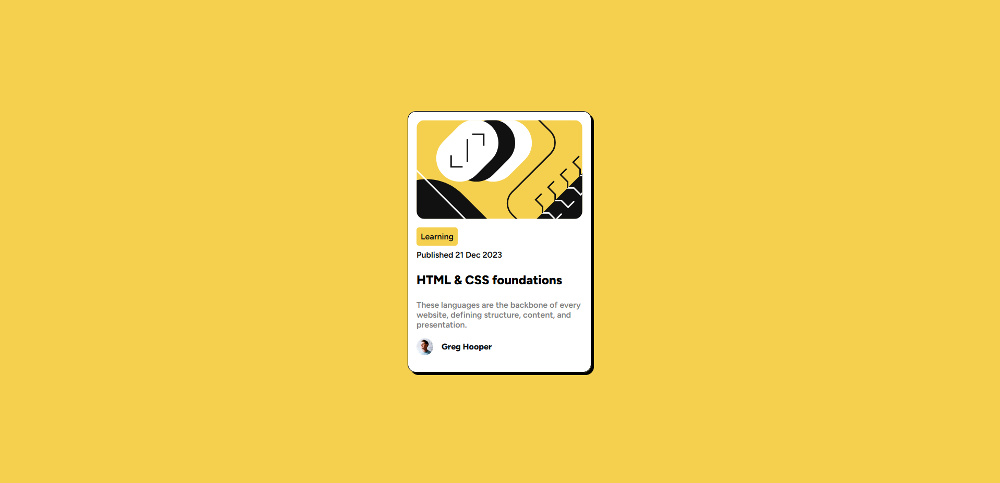

# Frontend Mentor - Blog preview card solution

This is a solution to the [Blog preview card challenge on Frontend Mentor](https://www.frontendmentor.io/challenges/blog-preview-card-ckPaj01IcS). Frontend Mentor challenges help you improve your coding skills by building realistic projects. 

## Table of contents

- [Overview](#overview)
  - [The challenge](#the-challenge)
  - [Screenshot](#screenshot)
  - [Links](#links)
- [My process](#my-process)
  - [Built with](#built-with)
  - [What I learned](#what-i-learned)
  - [Continued development](#continued-development)
- [Author](#author)
- [Acknowledgments](#acknowledgments)

## Overview

### The challenge

Users should be able to:

- See hover and focus states for all interactive elements on the page

### Screenshot

Desktop solution

### Links

- Solution URL: [Github repository](https://github.com/funficient/fem-blog-preview-card)
- Live Site URL: [Github Pages](https://funficient.github.io/fem-blog-preview-card/)

## My process

### Built with

- Semantic HTML5 markup
- CSS custom properties
- Flexbox
- CSS Grid

### What I learned

This was a great practice round to speed up my basic skills.

### Continued development

Would like to understand the transitions better and how to best make use of it.

## Author

- Website - [fun-fi-cient](https://www.funficient.com)
- Frontend Mentor - [@yfunficient](https://www.frontendmentor.io/profile/funficient)

## Acknowledgments

Thanks to the FrontEnd Mentor community for always being supportive and constantly coming up with new challenges!